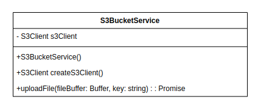

# Technical Design Document: Bulk Image Resizer Backend

## 1. Introduction

The **Bulk Image Resizer Backend** is designed to efficiently process and compress images based on input provided through a CSV file. The system handles large batches of images asynchronously, ensuring fast and scalable image processing.

### Objectives and Requirements

The system performs the following tasks:

1. **Input and Output**: Accepts a CSV file containing the following columns:

   - **Serial Number**: Unique identifier for each product.
   - **Product Name**: Name of the product associated with the images.
   - **Image URLs**: Comma-separated list of image URLs to be processed.

2. **Asynchronous Processing**: Compresses the images to 50% of their original quality, making sure while one file is being processed, the other files are not blocked. This ensures that the system can handle large batches of images efficiently.

3. **Output**: Generates a new CSV file with the same structure, but with an additional column for the URLs of the compressed images.

4. **API Endpoints**:

   - **Upload API**: Accepts the input CSV, validates its format, and returns a unique request ID.

   - **Status API**: Allows users to check the processing status of their images using the request ID.

5. **Callback**: If the user provides a callback URL, the system will send a POST request to the callback URL with the status of the image processing.

## 2. System Architecture

The system uses two system architecture with the following components:

.jpg>)

- **API Server**: Handles incoming requests, validates input, manages job creation, and queues tasks.
- **Job Queues**: Uses Redis and BullMQ to manage tasks asynchronously.
- **Worker Servers**: Stateless servers that process image tasks asynchronously.

## 3. Componenets detailed Description

### 3.1 API Router

API router is responsible for handling incoming requests and routing them to the appropriate controller. It is built using Express.js and consists of the following routes:

1.  **POST {{hostname}}/jobs**:

    - This route is used to upload a CSV file containing image URLs for processing.

    ```json
    {
      "file": Buffer,
      "webhook": string
    }
    ```

    - This request should go through following middlewares

    ```json
    [
       validateRequest,
       validateCsvMiddleware
    ]
    ```

    - The response should contain a unique request ID.

    ```
    {
       message: string
       job_id: uuid
    }
    ```

2.  **GET {{hostname}}/jobs/?job_id**:
    - This route is used to check the status of a job using the request ID.
    - The response should contain the status of the job.
    ```
    {
       message: string
       data: {
          job_id: uuid,
          status: string,
          webhook: string,
          webhook_sent: boolean,
          input_csv_url: string,
          output_csv_url: string
       }
    }
    ```

### 3.2 Validate Csv Middleware

This middleware is responsible for validating the format of the CSV file uploaded by the user. It checks if the file contains the required columns and if the image URLs are valid.

It should check if:

- Valid csv file has been uploaded
- csv file meets size constrains
- csv file matches the correct shape
- csv file headers are spelled correctly
- Serial Number column is unique and not empty
- Product Name column is not empty
- Image URLs column is not empty and contains valid URLs

### 3.3 Job Controller

The Job Controller is responsible for creating and managing image processing jobs. It interacts with

- API Router
- Job Repository
- Job Queue
- S3 bucket service

It should have the following methods:

1. **createNewJobController**:

   - This method creates a new job in the database and adds it to the job queue for processing.
   - It should parse the csv in a more manageable format, for example:

   ```
   interface JobData {
      url: string;
      metadata: Record<string, any>; // Flexible type for metadata object
   }
   ```

   - It should return following response

   ```
     {
        message: string
        job_id: uuid
     }
   ```

   - This method willl need to interacts with JobRepository and JobQueue

2. **fetchJobStatus**
   - This method fetches the status of a job using the request ID.
   - It should return following response
   ```
     {
        message: string
        data: {
           job_id: uuid,
           status: string,
           webhook: string,
           webhook_sent: boolean,
           input_csv_url: string,
           output_csv_url: string
        }
     }
   ```
   - This method willl need to interacts with JobRepository

### 3.3 S3 Bucket Service

This service is responsible for uploading and downloading files to and from an AWS S3 bucket.


It should have the following methods:

1. **uploadFile**:
   - This method uploads a file to the S3 bucket.
   - It should take following parameters
   ```
     {
        fileBuffer: Buffer,
        key: string
     }
   ```

### 3.4 Job Repository

The Job Repository is responsible for interacting with the database to create, update, and fetch job details. It should have the following methods:

1. **createNewJob**:

   - This method creates a new job in the database.
   - It should take following parameters

   ```
   interface IJob {
      job_id: string;
      webhook?: string;
      webhook_sent?: boolean;
      status: JobStatus;
      job_type: JobType;
      data: JobData[];
      input_csv_url: string;
      output_csv_url?: string;
   }
   ```

   - job_id shoud be the one returned by BullMQ when a job is added to the queue

2. **fetchJobById**:
   - This method fetches the details of a job using the request ID.
   - It should return following response
   ```
   interface IJob {
      job_id: string;
      webhook?: string;
      webhook_sent?: boolean;
      status: JobStatus;
      job_type: JobType;
      data: JobData[];
      input_csv_url: string;
      output_csv_url?: string;
   }
   ```
   - job_id shoud be the one returned by BullMQ when a job is added to the queue

### 3.5.1 Job Queue

The Job Queue is responsible for managing image processing tasks asynchronously. It uses Redis and BullMQ to handle the queue. It should have the following methods:

1. **addJobToQueue**:

   - This method adds a new job to the queue for processing.
   - It should take following parameters

   ```
   interface JobPayload {
      id: string;
      jobtype: JobType;
      data: JobData[];
   }

   enum JobType {
      ReduceQuality = 'reduceQuality',
   }

   nterface JobData {
      url: string;
      metadata: Record<string, any>; // Flexible type for metadata object
   }
   ```

   - controllers need to interact with queue using this method

### 3.5.1 Job Listener

The Job Listener is responsible for listening to the job queue and processing the image tasks. It should have the following methods: It needs to listen for 'completed" jobs.

It should have the following methods:

1. **startListening**:

   - This method lstarts the listener to listen to the job queue for completed tasks.
   - This method needs to create a job in result queue.

2. **createNewResultJob**:

   - This method creates a new job in the result queue for processing.
   - It should take following parameters

   ```
   {
      job_id: string,
      data: ResultJobData[]
   }

   export interface ResultJobData {
      status: PromiseStatus,
      value?: ResultJobDataValue,
      reason?: RejectedResultJobDataValue,
   }

   export enum PromiseStatus {
      Fulfilled = 'fulfilled',
      Rejected = 'rejected',
   }

   export interface ResultJobDataValue {
      success: boolean,
      metadata: Record<string, any>,
      url: string,
   }

   export interface RejectedResultJobDataValue {
      success: boolean,
      metadata: Record<string, any>,
      error: any,
      fileName: string,
   }
   ```

### 3.6 Result Queue

The Result Queue is responsible for managing the result of image processing tasks asynchronously. It uses Redis and BullMQ to handle the queue. It should have the following methods:

1. **addJobToQueue**:

   - This method adds a new job to the queue for processing.
   - It should take following parameters

   ```
   {
      payload: IResultJob
   }

   interface IResultJob {
      jobtype: JobType,
      job_id: string,
      data: ResultJobData[],
   }
   ```

### 3.7 WebHook Queue

The WebHook Queue is responsible for managing the WebHook tasks asynchronously. It uses Redis and BullMQ to handle the queue. It should have the following methods:

1. **addJobToQueue**:

   - This method adds a new job to the queue for processing.
   - It should take following parameters

   ```
   {
      payload: WebhookPayload
   }

   export interface WebhookPayload {
      job_id: string;
      webhook: string;
      status: JobStatus;
      input_csv_url: string;
      output_csv_url?: string;
   }

   ```

### 3.8 Result Worker

This worker retrives the job from the result queue and performs following tasks

1. Generates csv file from the result data
2. Uploads the csv file to S3
3. Updates the job status in the database along with the output csv url
4. Sends a webhook to the user if webhook is provided

This worker should have the following methods:

1. start(): This method starts the worker to listen to the result queue for completed tasks.

2. stop(): This method stops the worker from listening to the result queue.

3. processJob(): This method processes the job from the result queue and performs the tasks mentioned above.

### 3.9 WebHook Worker

This worker retrives the job from the webhook queue and performs following tasks

1. Sends a POST request to the webhook url with the job status

```
{
   job_id: string,
   status: string,
   input_csv_url: string,
   output_csv_url?: string
}
```

2. Updates the job status in the database with webhook_sent as true

This method should have the following methods:

1. start(): This method starts the worker to listen to the webhook queue for completed tasks.

2. stop(): This method stops the worker from listening to the webhook queue.

3. processJob(): This method processes the job from the webhook queue and performs the tasks mentioned above.

## 4. Job Workers

This system uses multiple workers to process the image tasks asynchronously. Each worker is responsible for a specific task and communicates with the Job Queue to fetch and process the tasks. The workers are stateless and can be scaled horizontally to handle large batches of images efficiently.

This worker class should have the following methods:

1. **start()**

   - This method starts the worker to listen to the job queue for new tasks.

2. **stop()**

   - This method stops the worker from listening to the job queue.

3. **processJob()**

   - This method processes the job from the job queue and performs the following tasks:
     - Downloads the images from the URLs provided in the job data.
     - Compresses the images to 50% of their original quality.
     - Uploads the compressed images to the S3 bucket.
     - Attaches new URLs of the compressed images to the job data.

   ```
   enum JobType {
      ReduceQuality = 'reduceQuality',
   }


   JobData {
      url: string;
      metadata: Record<string, any>;
   }

   type UploadResult = {
      success: boolean;
      metadata?: Record<string, any>;
      error?: Error;
      url?: string;
   };
   ```

   - This method should return a promise with the following response:

   ```
   {
      success: boolean,
      metadata: Record<string, any>,
      url: string,
   }
   ```

## 5. Interfaces

```
interface JobData {
  url: string;
  metadata: Record<string, any>;
}

type UploadResult = {
  success: boolean;
  metadata?: Record<string, any>;
  error?: Error;
  url?: string;
};


/* Job Model related Constants */
enum JobStatus {
  Queued = 'queued',
  Processing = 'processing',
  Completed = 'completed',
  Failed = 'failed',
}

enum JobType {
  ReduceQuality = 'reduceQuality',
}

interface JobData {
  url: string;
  metadata: Record<string, any>; // Flexible type for metadata object
}

interface IJob {
  job_id: string;
  webhook?: string;
  webhook_sent?: boolean;
  status: JobStatus;
  job_type: JobType;
  data: JobData[];
  input_csv_url: string;
  output_csv_url?: string;
}

interface JobDocument extends Document {
  job_id: string;
  webhook?: string;
  webhook_sent?: boolean;
  status: JobStatus;
  job_type: JobType;
  data: JobData[];
  input_csv_url: string;
  output_csv_url?: string;
}

/* Middleware related related Constants */

interface ICsvData {
  'S. No.': string;
  'Product Name': string;
  'Input Image Urls': string;
}

interface RequestWithCSV extends Request {
  csv: ICsvData[];
}

/* Queue related related Constants */

interface JobPayload {
  id: string;
  jobtype: JobType;
  data: JobData[];
}

/* Error handler related constants */
interface APIError extends Error {
  status?: number;
}

/* Result queue related constants */
enum PromiseStatus {
  Fulfilled = 'fulfilled',
  Rejected = 'rejected',
}

interface ResultJobDataValue {
  success: boolean,
  metadata: Record<string, any>,
  url: string,
}

interface RejectedResultJobDataValue {
  success: boolean,
  metadata: Record<string, any>,
  error: any,
  fileName: string,
}

interface ResultJobData {
  status: PromiseStatus,
  value?: ResultJobDataValue,
  reason?: RejectedResultJobDataValue,
}

interface IResultJob {
  jobtype: JobType,
  job_id: string,
  data: ResultJobData[],
}

/* webhook related constants */

interface WebhookPayload {
  job_id: string;
  webhook: string;
  status: JobStatus;
  input_csv_url: string;
  output_csv_url?: string;
}

```
